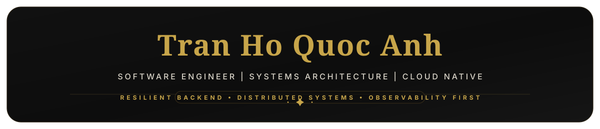

<h1 align="center">
  
</h1>

  

## Overview

  Software Engineer focused on resilient backend systems, high-availability distributed architectures, domain-driven design, and observable cloud-native services.

  Building distributed backend systems with Spring Boot, .NET, Kafka, Docker, and observability-first architecture.

  

## Tech Stack

  
  
  
  
  
  
  
  

  
  
  
  
  
  
  
  
  

  
  

  

## Telemetry &amp; Metrics

  
  
  
  
  
  
  
  

  

  
  

  

  

  

## Spotify

  

  

## Connect

  
  
  
  
  
  
  

 

  

